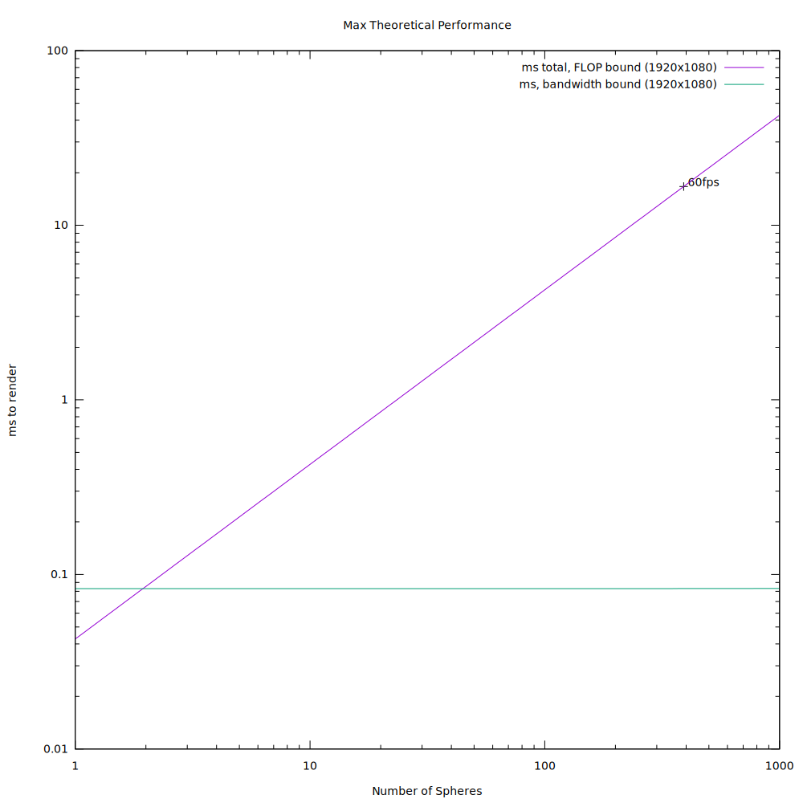
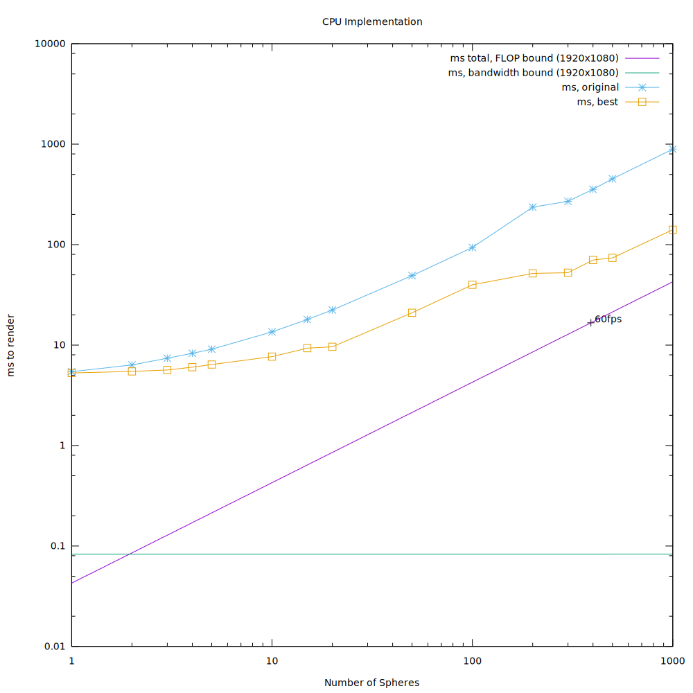
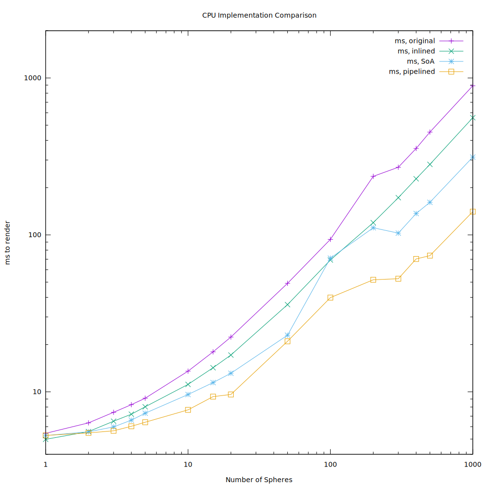
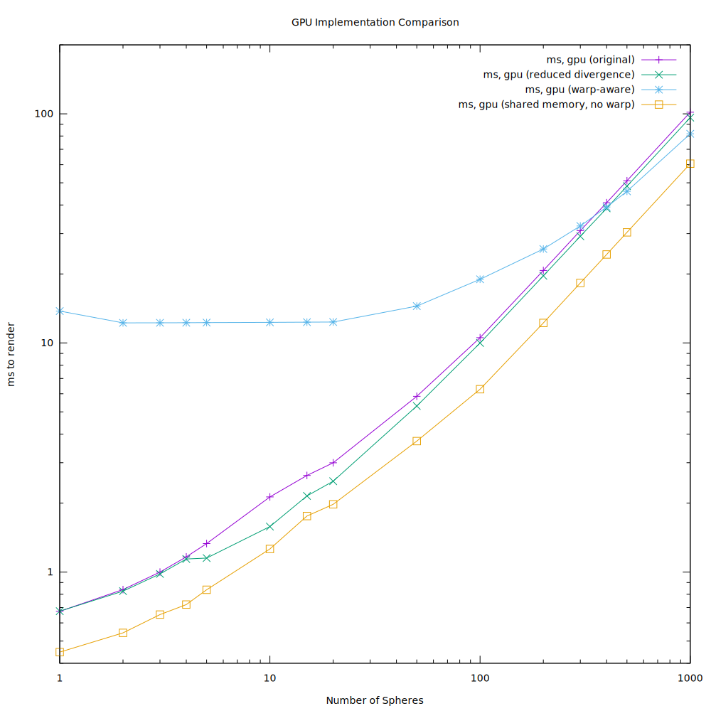

## The Appplication: Raytracing
Raytracing is an algorithm for rendering in a highly detailed, physically accurate way. In real life, light is emitted by light sources, bounces off of (or is refracted by) objects, and then some of that light hits our eye or a camera. For speed, raytracing involves going backwards: start at the "eye", shoot a ray outwards, and if collisions are detected, use those to generate a color for each pixel of the image.

In this specific implementation of raytracing, full physical accuracy is not expected. It will generate an image which is shaded in a very simple manner, using sphere primatives.

## Perfomance Estimation
#### CPU
Raytracing is not very memory intensive. For small scenes with few objects, the only memory that will be used is roughly 20 bytes per sphere in the scene,
and about 50 bytes for the view object. Pretty much any thread will be able to contain the entire set of scene information in cache. Also, all of the scene
information is not modified during rendering. The result of all of these factors is that the rendering process can have almost no overhead.

Increasing the number of spheres does increase the memory bandwidth needed. We can get an estimate of this:
`bandwidth = imageWidth*imageHeight*4 + numSpheres*20 + 50`

Determining the bound sizes of flops comes down to estimating the number of FLOPs needed per pixel.
There are two functions which represent the bulk of the floating-point work done. These are:

* `ray view::getRayForPixel(int x, int y)`
* `rayhit ray::castAgainst(const sphere s)`

The first of these returns an eye ray for a given pixel. In the initial version, this function is poorly optimized.
All that really needs to be done is either 1 or 2 adds, but it is doing many multiplications, additions, and even a sqrt().
(Currently, 12 multiplications, 2 additions, and 1 square root. Optimally, this would be 2 additions only.)

The second function returns the "best hit" for a ray against a sphere, which includes information such as the hit point and hit normal.
If there is no collision, that is also recorded.
Currently, the operation tally of this function is 15 multiplications, 21 adds, 1 branch, and 2 square roots. This happens on a per-sphere basis.

So, we can get a rough estimate of FLOPs. If *n* is the number of spheres, that gives us 35\*n FLOPs per pixel, or 35\*n\*w\*h FLOPs per image.

The estimated performance, in milliseconds taken to render a 1920x1080 image:

Note the marker, at t = 16.67ms. This is the speed needed to achieve 60 frames per second in a
real-time application. In this theoretical model, that can be achieved with ~390 spheres.

#### GPU

For the GPU implementation, these numbers become less clear. We know that the [Nvidia K80's](http://www.nvidia.com/object/tesla-k80.html)
dual-GPU design is capable of 8.73 TFLOPS, which means we can expect roughly
4.3 TFLOPS by making use of only one GPU. Since the target performance of the CPU implementation
was 1.7 TFLOPS, we can expect at least double the performance. In other words,
the GPU should take, at most, half the time to complete that the CPU version does.

## Real Performance measurement
### CPU
This graph shows expected performance, and actual performance of different versions of the CPU implementation.

#### Improvement: Inlined
The inlined version represents the improvement gained by inlining many functions, especially vector functions.

#### Improvement: Structure of Arrays
The SoA version replaces the previous method of calling ray::castAgainst(sphere) with a more streamlined version.
The major optimization here is that sphere objects are no longer necessary. Instead, arrays of positions (px, py, and pz)
are used to represent the spheres. This makes memory accesses more predictable and closer together, since it is so common
to do operations like x1\*x2 + y1\*y2. In addition, there is no longer a seperate function for casting against a sphere.
Rays are cast against all spheres in a row inside of the getColorAtPixel function.

#### Improvement: Pipelined
The pipelined version changes how the code is written to make it easier for the compiler to properly vectorize it.
Each thread, instead of processing line-sphere intersections for one sphere at a time, processes multiple spheres
in parallel using SIMD. This change doubled the speed of the CPU implementation.

This is a graph comparing the versions of my CPU implementation:

Clearly, performance has gotten significantly better―1000 spheres has gone from almost 900ms to 140ms.
However, this is still short of the theoretical max, which is about 43ms.

### GPU
This graph shows the performance of several different versions of the GPU implementation.

Note that the original is only modestly faster than the best CPU implentation for high numbers of
spheres, but 10x faster for a single sphere.

#### Improvement: Reduced Divergence
This minor change involved moving hit point calculations, so that (1) each thread would do less work overall,
and (2) it would be less likely for any two threads within the same warp to have largely different
amounts of work to do, thereby decreasing divergence.

#### Improvement: Better Warps
The original version didn't take warps into account, for the most part. Originally, each thread
calculated the color value for a single pixel. In this version, each *warp* calculates the color
value of a pixel. Warp shuffling is used to find the "best hit" of the raycast. Shared memory is
also implemented.

This version gave much worse results than I expected. Although it was a slight improvement for large
numbers of spheres (1000), it was significantly slower than any CPU implementation for small numbers of spheres.
This was due to the fact that, in cases of only one sphere, 31/32 (96.9%) of the total threads in use were idle.
Even with large numbers of spheres, it seems that shared memory was the only redeeming factor of this implementation.

#### Improvement: Shared Memory
Since the warp-based restructuring failed, I backported the shared memory part of the implementation to
my previous best. This version also uses grid-stride loops, which means that each thread, when finished
with one pixel, jumps ahead in the pixel list by the size of the grid. This allows for maximizing occupancy of
the GPU without worrying about changing grid or block sizes depending on the size of the problem. It also
should maximize coalescence.

This version resulted in a 2.3x speedup over the best CPU implementation.