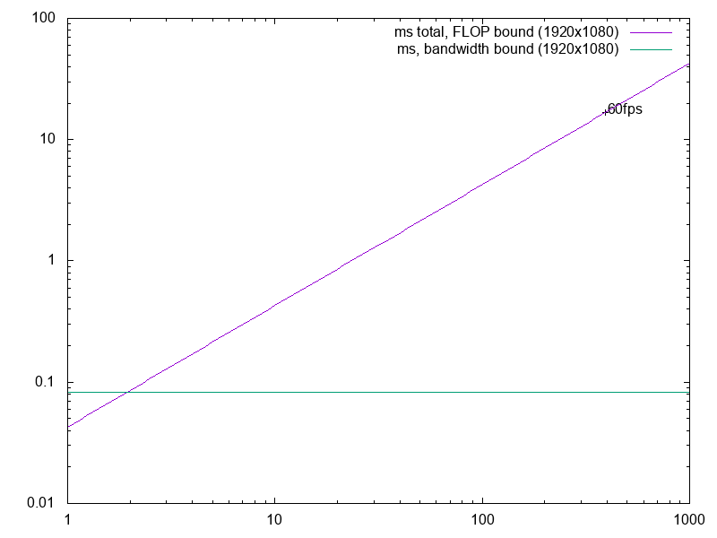
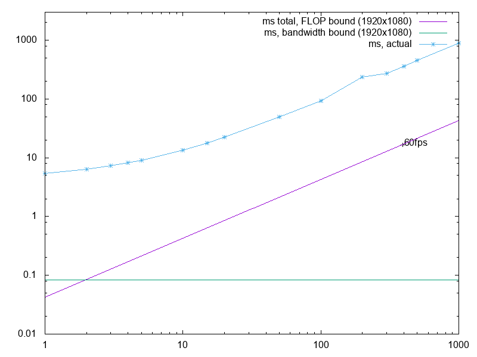

## The Appplication: Raytracing
Raytracing is an algorithm for rendering in a highly detailed, physically accurate way. In real life, light is emitted by light sources, bounces off of (or is refracted by) objects, and then some of that light hits our eye or a camera. For speed, raytracing involves going backwards: start at the "eye", shoot a ray outwards, and if collisions are detected, use those to generate a color for each pixel of the image.

In this specific implementation of raytracing, full physical accuracy is not expected. It will generate an image which is shaded in a very simple manner, using sphere primatives.

## Perfomance Estimation
Raytracing is not very memory intensive. For small scenes with few objects, the only memory that will be used is roughly 20 bytes per sphere in the scene,
and about 50 bytes for the view object. Pretty much any thread will be able to contain the entire set of scene information in cache. Also, all of the scene
information is not modified during rendering. The result of all of these factors is that the rendering process can have almost no overhead.

Increasing the number of spheres does increase the memory bandwidth needed. We can get an estimate of this:
`bandwidth = imageWidth*imageHeight*4 + numSpheres*20 + 50`

Determining the bound sizes of flops comes down to estimating the number of FLOPs needed per pixel.
There are two functions which represent the bulk of the floating-point work done. These are:

* `ray view::getRayForPixel(int x, int y)`
* `rayhit ray::castAgainst(const sphere s)`

The first of these returns an eye ray for a given pixel. In the initial version, this function is poorly optimized.
All that really needs to be done is either 1 or 2 adds, but it is doing many multiplications, additions, and even a sqrt().
(Currently, 12 multiplications, 2 additions, and 1 square root. Optimally, this would be 2 additions only.)

The second function returns the "best hit" for a ray against a sphere, which includes information such as the hit point and hit normal.
If there is no collision, that is also recorded.
Currently, the operation tally of this function is 15 multiplications, 21 adds, 1 branch, and 2 square roots. This happens on a per-sphere basis.

So, we can get a rough estimate of FLOPs. If *n* is the number of spheres, that gives us 35\*n FLOPs per pixel, or 35\*n\*w\*h FLOPs per image.

The estimated performance, in milliseconds taken to render a 1920x1080 image:

## Real Performance measurement (Updated)
This is the graph, showing expected performance, and actual performance of three different versions of the program.

The blue line is the measured performance of the original implementation, in milliseconds per 1920x1080 image, compared to the theoretical best.

The inlined version represents the improvement gained by inlining many functions, especially vector functions.

The SoA version replaces the previous method of calling ray::castAgainst(sphere) with a more streamlined version.
The major optimization here is that sphere objects are no longer necessary. Instead, arrays of positions (px, py, and pz)
are used to represent the spheres. This makes memory accesses more predictable and closer together, since it is so common
to do operations like x1\*x2 + y1\*y2. In addition, there is no longer a seperate function for casting against a sphere.
Rays are cast against all spheres in a row inside of the getColorAtPixel function.

This is a graph comparing three versions of my implementation:

Clearly, performance has gotten significantly better―1000 spheres has gone from almost 900ms to 315ms.
However, this is still short of the theoretical max, which is about 43ms.
I'm not quite sure which improvements should be made next. It seems likely that vectorization through AVX
is slower than it could be if it were made explicit. Additionally, many spheres could be skipped altogether
with more clever checking (which means it could be possible to exceed max performance).